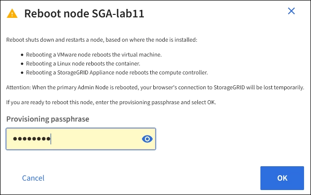

= 
:allow-uri-read: 

.Étapes
. Sélectionnez *NOEUDS*.
. Sélectionnez le nœud de grille que vous souhaitez redémarrer.
. Sélectionnez l'onglet *tâches*.
+
image::../media/maintenance_mode.png[Bouton nœuds > tâches > redémarrer]

. Sélectionnez *Reboot*.
+
Une boîte de dialogue de confirmation s'affiche.

+

+

NOTE: Si vous redémarrez le nœud d'administration principal, la boîte de dialogue de confirmation vous rappelle que la connexion de votre navigateur au Grid Manager sera interrompue temporairement lorsque les services sont arrêtés.

. Entrez la phrase de passe de provisionnement et sélectionnez *OK*.
. Attendez que le nœud redémarre.
+
La fermeture des services peut prendre un certain temps.

+
Lorsque le nœud est en cours de redémarrage, l'icône grise (administrativement en panne) s'affiche sur le côté gauche de la page *Nodes*. Lorsque tous les services ont redémarré et que le nœud est connecté avec succès à la grille, la page *noeuds* doit afficher un état normal (aucune icône à gauche du nom du nœud), indiquant qu'aucune alerte n'est active et que le nœud est connecté à la grille.

