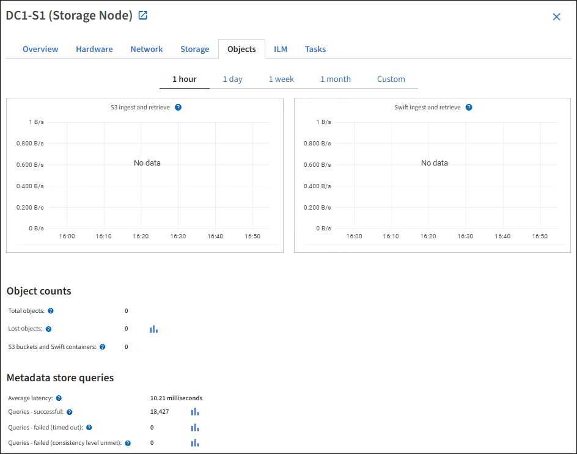
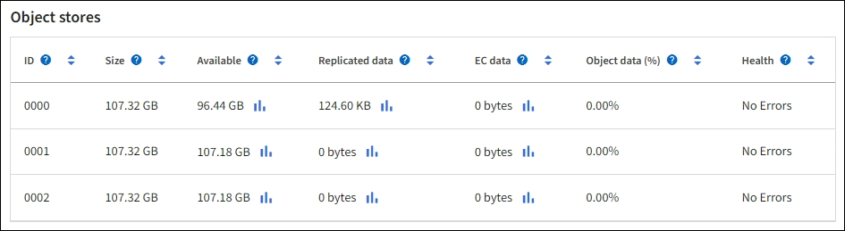

= Qu'est-ce qu'un nœud de stockage ?
:allow-uri-read: 
:icons: font
:imagesdir: ../media/

[role="lead"]
Des nœuds de stockage gèrent et stockent les données et les métadonnées d'objets. Chaque système StorageGRID doit disposer d'au moins trois nœuds de stockage. Si vous avez plusieurs sites, chaque site de votre système StorageGRID doit également disposer de trois nœuds de stockage.

Un nœud de stockage inclut les services et les processus nécessaires pour stocker, déplacer, vérifier et récupérer les données d'objet et les métadonnées sur le disque. Vous pouvez afficher des informations détaillées sur les nœuds de stockage sur la page *NODES*.

== Qu'est-ce que le service ADC ?

Le service contrôleur de domaine d'administration (ADC) authentifie les nœuds de la grille et leurs connexions entre eux. Le service ADC est hébergé sur chacun des trois premiers nœuds de stockage d'un site.

Le service ADC conserve les informations de topologie, notamment l'emplacement et la disponibilité des services. Lorsqu'un nœud de grille nécessite des informations provenant d'un autre nœud de grille ou qu'une action soit effectuée par un autre nœud de grille, il contacte un service ADC pour trouver le nœud de grille le plus adapté au traitement de sa demande. De plus, le service ADC conserve une copie des packs de configuration du déploiement StorageGRID, ce qui permet à n'importe quel nœud de la grille de récupérer les informations de configuration actuelles.vous pouvez afficher les informations ADC d'un nœud de stockage sur la page topologie de la grille (*PRISE EN CHARGE* > *topologie de la grille*).

Pour faciliter les opérations distribuées et en attente, chaque service ADC synchronise les certificats, les lots de configuration et les informations sur les services et la topologie avec les autres services ADC du système StorageGRID.

En général, tous les nœuds de la grille maintiennent une connexion à au moins un service ADC. Les nœuds du grid accèdent ainsi aux informations les plus récentes. Lorsque les nœuds de la grille se connectent, ils mettent en cache les certificats d'autres nœuds de la grille, ce qui permet aux systèmes de continuer à fonctionner avec les nœuds de la grille connus même lorsqu'un service ADC n'est pas disponible. Les nouveaux nœuds de grille ne peuvent établir de connexions qu'à l'aide d'un service ADC.

La connexion de chaque nœud de grille permet au service ADC de collecter les informations de topologie. Ces informations sur le nœud de la grille incluent la charge CPU, l'espace disque disponible (si le système dispose de stockage), les services pris en charge et l'ID de site du nœud de la grille. D'autres services demandent au service ADC d'obtenir des informations sur la topologie par le biais de requêtes de topologie. Le service ADC répond à chaque requête avec les dernières informations reçues du système StorageGRID.

== Qu'est-ce que le service DDS ?

Hébergé par un nœud de stockage, le service DDS (Distributed Data Store) s'interface avec la base de données Cassandra pour effectuer des tâches en arrière-plan sur les métadonnées d'objet stockées dans le système StorageGRID.

=== Nombre d'objets

Le service DDS suit le nombre total d'objets ingérés dans le système StorageGRID, ainsi que le nombre total d'objets ingérés par chacune des interfaces prises en charge par le système (S3 ou Swift).

Vous pouvez voir le nombre total d'objets sur la page nœuds > onglet objets pour n'importe quel nœud de stockage.

=== Requêtes

Vous pouvez identifier le temps moyen d'exécution d'une requête sur le magasin de métadonnées par le biais du service DDS spécifique, du nombre total de requêtes réussies et du nombre total de requêtes ayant échoué en raison d'un problème de délai d'attente.

Un examen des informations de requête peut être nécessaire afin de contrôler l'état du datastore Cassandra, ce qui a un impact sur les performances d'entrée et de récupération du système. Par exemple, si la latence d'une requête moyenne est lente et que le nombre de requêtes ayant échoué en raison de délais d'attente est élevé, le magasin de métadonnées peut rencontrer une charge plus élevée ou effectuer une autre opération.

Vous pouvez également afficher le nombre total de requêtes ayant échoué en raison d'échecs de cohérence. Les échecs de niveau de cohérence résultent d'un nombre insuffisant de magasins de métadonnées disponibles au moment où une requête est effectuée par le biais du service DDS spécifique.

Vous pouvez utiliser la page Diagnostics pour obtenir des informations supplémentaires sur l'état actuel de votre grille. Voir link:../monitor/running-diagnostics.html["Exécuter les diagnostics"].

=== Garanties et contrôles de cohérence

StorageGRID garantit la cohérence de lecture après écriture pour les nouveaux objets. Toute opération GET après une opération PUT réussie sera capable de lire les données récemment écrites. Les écrasements d'objets existants, les mises à jour de métadonnées et les suppressions restent cohérents.

== Qu'est-ce que le service LDR ?

Hébergé par chaque nœud de stockage, le service LDR (local distribution Router) gère le transport de contenu pour le système StorageGRID. Le transport de contenu englobe de nombreuses tâches, dont le stockage des données, le routage et le traitement des demandes. Le service LDR effectue la plupart du travail acharné du système StorageGRID en gérant les charges de transfert de données et les fonctions de trafic de données.

Le service LDR gère les tâches suivantes :

* Requêtes
* Activité liée à la gestion du cycle de vie des informations (ILM)
* Suppression d'objet
* Stockage des données objet
* Transferts de données objet à partir d'un autre service LDR (nœud de stockage)
* Gestion du stockage des données
* Interfaces de protocole (S3 et Swift)

Le service LDR gère également le mappage d'objets S3 et Swift vers des UUID (« content handle ») uniques que le système StorageGRID attribue à chaque objet ingéré.

=== Requêtes

Les requêtes LDR incluent des requêtes pour l'emplacement des objets lors des opérations de récupération et d'archivage. Vous pouvez identifier le temps moyen d'exécution d'une requête, le nombre total de requêtes réussies et le nombre total de requêtes ayant échoué en raison d'un problème de délai d'attente.

Vous pouvez examiner les informations de requête afin de contrôler l'état du magasin de métadonnées, ce qui a un impact sur les performances d'entrée et de récupération du système. Par exemple, si la latence d'une requête moyenne est lente et que le nombre de requêtes ayant échoué en raison de délais d'attente est élevé, le magasin de métadonnées peut rencontrer une charge plus élevée ou effectuer une autre opération.

Vous pouvez également afficher le nombre total de requêtes ayant échoué en raison d'échecs de cohérence. Les défaillances de niveau de cohérence résultent d'un nombre insuffisant de magasins de métadonnées disponibles au moment où une requête est exécutée via le service LDR spécifique.

Vous pouvez utiliser la page Diagnostics pour obtenir des informations supplémentaires sur l'état actuel de votre grille. Voir link:../monitor/running-diagnostics.html["Exécuter les diagnostics"].

=== Activité des règles ILM

Les metrics de gestion du cycle de vie des informations vous permettent de surveiller la vitesse à laquelle les objets sont évalués pour la mise en œuvre de ILM. Vous pouvez afficher ces mesures sur le tableau de bord ou sur *NODES* > *_Storage Node_* > *ILM*.

=== Magasins d'objets

Le stockage sous-jacent d'un service LDR est divisé en un nombre fixe de magasins d'objets (aussi appelés volumes de stockage). Chaque magasin d'objets est un point de montage distinct.

Les magasins d'objets d'un nœud de stockage s'affichent sur la page nœuds > onglet stockage.

Les magasins d'objets d'un nœud de stockage sont identifiés par un nombre hexadécimal compris entre 0000 et 002F, appelé ID de volume. L'espace est réservé dans le premier magasin d'objets (volume 0) pour les métadonnées d'objet dans une base de données Cassandra. Tout espace restant sur ce volume est utilisé pour les données d'objet. Tous les autres magasins d'objets sont exclusivement utilisés pour les données d'objet, notamment les copies répliquées et les fragments avec code d'effacement.

Pour garantir même l'utilisation de l'espace pour les copies répliquées, les données d'objet d'un objet donné sont stockées dans un magasin d'objets basé sur l'espace de stockage disponible. Lorsqu'un ou plusieurs magasins d'objets sont remplis à la capacité, les magasins d'objets restants continuent de stocker des objets jusqu'à ce qu'il n'y ait plus d'espace sur le nœud de stockage.

=== Protection des métadonnées

Les métadonnées de l'objet sont des informations liées ou une description d'un objet. Par exemple, l'heure de modification de l'objet ou l'emplacement de stockage. StorageGRID stocke les métadonnées d'objet dans une base de données Cassandra, qui assure l'interface avec le service LDR.

Pour assurer la redondance et ainsi la protection contre la perte, trois copies des métadonnées d'objet sont conservées sur chaque site. Cette réplication n'est pas configurable et se fait automatiquement.

link:managing-object-metadata-storage.html["Gérer le stockage des métadonnées d'objet"]
