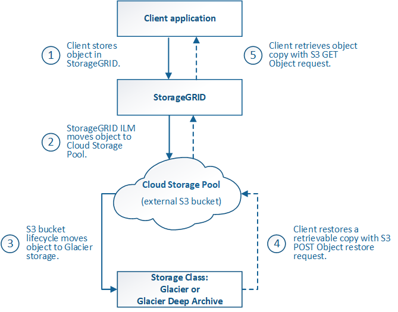

= Cycle de vie d'un objet de pool de stockage cloud
:allow-uri-read: 
:icons: font
:imagesdir: ../media/

[role="lead"]
Avant d'implémenter les pools de stockage cloud, vérifiez le cycle de vie des objets stockés dans chaque type de pool de stockage cloud.

* <<S3 : cycle de vie d'un objet de pool de stockage cloud>>
* <<Azure : cycle de vie d'un objet de pool de stockage cloud>>

== S3 : cycle de vie d'un objet de pool de stockage cloud

La figure représente les étapes du cycle de vie d'un objet stocké dans un pool de stockage cloud S3.

NOTE: Dans la figure et les explications, « Glacier » désigne à la fois la classe de stockage Glacier et la classe de stockage Glacier Deep Archive, à une exception près : la classe de stockage Glacier Deep Archive ne prend pas en charge le niveau de restauration accéléré. Seule la récupération en bloc ou standard est prise en charge.

NOTE: Google Cloud Platform (GCP) prend en charge la récupération d'objets à partir d'un stockage à long terme sans nécessiter de POST-restauration.

. *Objet stocké dans StorageGRID*
+
Pour démarrer le cycle de vie, une application client stocke un objet dans StorageGRID.

. *Objet déplacé vers le pool de stockage cloud S3*
+
** Lorsque l'objet est associé à une règle ILM utilisant un pool de stockage cloud S3 en tant qu'emplacement, StorageGRID déplace l'objet vers le compartiment S3 externe spécifié par le pool de stockage cloud.
** Lorsque l'objet a été déplacé vers le pool de stockage cloud S3, l'application client peut la récupérer à l'aide d'une requête d'objet GET S3 de StorageGRID, à moins que l'objet n'ait été transféré vers le stockage Glacier.

. *L'objet a été transféré vers Glacier (état non récupérable)*
+
** L'objet peut également être transféré vers le stockage Glacier. Par exemple, un compartiment S3 externe peut utiliser la configuration du cycle de vie pour transférer un objet vers le stockage Glacier immédiatement ou après quelques jours.
+

NOTE: Si vous souhaitez effectuer la transition des objets, vous devez créer une configuration de cycle de vie pour le compartiment S3 externe. Pour ce faire, vous devez utiliser une solution de stockage implémentant la classe de stockage Glacier et prendre en charge l'API S3 POST-restauration objet.

+

NOTE: N'utilisez pas les pools de stockage cloud pour les objets qui ont été ingérés par les clients Swift. Swift ne prend pas en charge les demandes DE restauration POST-objet. StorageGRID ne pourra donc pas récupérer d'objets Swift ayant été transférés vers le stockage Glacier S3. L'émission d'une demande d'objet GET Swift pour récupérer ces objets échouera (403 interdit).

** Lors de la transition, l'application client peut utiliser une requête objet TÊTE S3 pour contrôler l'état de l'objet.

. *Objet restauré à partir du stockage Glacier*
+
Lorsqu'un objet est transféré vers le stockage Glacier, l'application client peut émettre une demande de restauration APRÈS objet S3 pour restaurer une copie récupérable dans le pool de stockage cloud S3. La demande spécifie le nombre de jours pendant lesquels la copie doit être disponible dans le pool de stockage cloud et le Tier d'accès aux données à utiliser pour l'opération de restauration (accéléré, Standard ou en bloc). Lorsque la date d'expiration de la copie récupérable est atteinte, la copie est automatiquement renvoyée à un état non récupérable.

+

NOTE: Si une ou plusieurs copies de l'objet existent également sur les nœuds de stockage dans StorageGRID, il n'est pas nécessaire de restaurer l'objet à partir de Glacier à l'aide d'une demande DE restauration POST-objet. En revanche, la copie locale peut être récupérée directement à l'aide d'une demande D'OBJET GET.

. *Objet récupéré*
+
Une fois qu'un objet a été restauré, l'application client peut émettre une requête GET Object pour récupérer l'objet restauré.

== Azure : cycle de vie d'un objet de pool de stockage cloud

La figure représente les étapes du cycle de vie d'un objet stocké dans un pool de stockage cloud Azure.

image::../media/cloud_storage_pool_object_life_cycle_azure.png[Cycle de vie d'un objet de pool de stockage cloud Azure]

. *Objet stocké dans StorageGRID*
+
Pour démarrer le cycle de vie, une application client stocke un objet dans StorageGRID.

. *Objet déplacé vers Azure Cloud Storage Pool*
+
Lorsque l'objet est associé à une règle ILM utilisant un pool de stockage cloud Azure comme emplacement, StorageGRID déplace l'objet vers le conteneur de stockage Azure Blob externe spécifié par le pool de stockage cloud

+

NOTE: N'utilisez pas les pools de stockage cloud pour les objets qui ont été ingérés par les clients Swift. Swift ne prend pas en charge les demandes DE restauration POST-objet. StorageGRID ne pourra donc pas récupérer d'objets Swift ayant été transférés vers le niveau d'archivage du stockage Azure Blob Storage. L'émission d'une demande d'objet GET Swift pour récupérer ces objets échouera (403 interdit).

. *L'objet a été transféré au niveau Archive (état non récupérable)*
+
Immédiatement après le déplacement de l'objet vers le pool de stockage cloud Azure, StorageGRID transfère automatiquement l'objet vers le Tier d'archivage du stockage Azure Blob.

. *Objet restauré à partir du niveau d'archive*
+
Si un objet a été migré vers le Tier d'archivage, l'application client peut lancer une demande de restauration S3 POST-objet pour restaurer une copie récupérable dans le pool de stockage cloud Azure.

+
Lorsqu'StorageGRID reçoit le POST-restauration d'objet, il transfère temporairement l'objet vers le Tier Azure Blob Storage Cool. Dès que la date d'expiration de la requête DE restauration POST-objet est atteinte, StorageGRID retransfère l'objet vers le niveau d'archivage.

+

NOTE: Si une ou plusieurs copies de l'objet existent également sur les nœuds de stockage dans StorageGRID, il n'est pas nécessaire de restaurer l'objet à partir du Tier d'accès Archive en émettant une demande de restauration POST-objet. En revanche, la copie locale peut être récupérée directement à l'aide d'une demande D'OBJET GET.

. *Objet récupéré*
+
Une fois qu'un objet a été restauré dans Azure Cloud Storage Pool, l'application client peut émettre une requête GET Object pour récupérer l'objet restauré.

.Informations associées
link:../s3/index.html["UTILISEZ L'API REST S3"]
