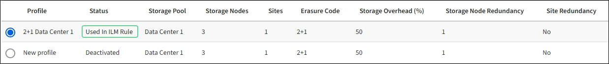

= Gestion des profils de code d'effacement
:allow-uri-read: 
:icons: font
:imagesdir: ../media/

[role="lead"]
Si nécessaire, vous pouvez renommer un profil de code d'effacement. Vous pouvez désactiver un profil de code d'effacement s'il n'est actuellement utilisé dans aucune règle ILM.

== Renommer un profil de code d'effacement

Vous pouvez renommer un profil de code d'effacement pour le rendre plus évident.

.Avant de commencer
* Vous êtes connecté au Grid Manager à l'aide d'un link:../admin/web-browser-requirements.html["navigateur web pris en charge"].
* Vous avez le link:../admin/admin-group-permissions.html["autorisations d'accès requises"].

.Étapes
. Sélectionnez *ILM* > *code d'effacement*.
. Sélectionnez le profil à renommer.
. Sélectionnez *Renommer*.
. Entrez un nom unique pour le profil de code d'effacement.
+
Le nom du profil de code d'effacement est ajouté au nom du pool de stockage dans l'instruction de placement d'une règle ILM.

+

NOTE: Les noms des profils de code d'effacement doivent être uniques. Une erreur de validation se produit si vous utilisez le nom d'un profil existant, même si ce profil a été désactivé.

. Sélectionnez *Enregistrer*.

== Désactiver un profil de code d'effacement

Vous pouvez désactiver un profil de code d'effacement si vous ne prévoyez plus de l'utiliser et si ce profil n'est pas utilisé dans les règles ILM.

.Avant de commencer
* Vous êtes connecté au Grid Manager à l'aide d'un link:../admin/web-browser-requirements.html["navigateur web pris en charge"].
* Vous avez le link:../admin/admin-group-permissions.html["autorisations d'accès requises"].
* Vous avez confirmé que aucune opération de réparation avec code d'effacement ou aucune procédure de désaffectation des données n'est en cours. Un message d'erreur s'affiche si vous tentez de désactiver un profil de code d'effacement alors que l'une de ces opérations est en cours.

.Description de la tâche
Lorsque vous désactivez un profil de code d'effacement, le profil apparaît toujours sur la page profils de code d'effacement, mais son état est *DESACTIVE*.

image::../media/deactivated_ec_profile.png[Profil EC désactivé]

Vous ne pouvez plus utiliser un profil de code d'effacement qui a été désactivé. Un profil désactivé n'apparaît pas lorsque vous créez les instructions de placement pour une règle ILM. Vous ne pouvez pas réactiver un profil désactivé.

StorageGRID vous empêche de désactiver un profil de code d'effacement si l'une des conditions suivantes est vraie :

* Le profil de code d'effacement est actuellement utilisé dans une règle ILM.
* Le profil de code d'effacement n'est plus utilisé dans les règles ILM, mais les données en objet et les fragments de parité du profil existent toujours.

.Étapes
. Sélectionnez *ILM* > *codage d'effacement*.
. Consultez la colonne *Status* pour confirmer que le profil de code d'effacement que vous souhaitez désactiver n'est utilisé dans aucune règle ILM.
+
Vous ne pouvez pas désactiver un profil de code d'effacement s'il est utilisé dans une règle ILM. Dans cet exemple, le profil *2+1 Data Center 1* est utilisé dans au moins une règle ILM.

+

. Si le profil est utilisé dans une règle ILM, effectuez la procédure suivante :
+
.. Sélectionnez *ILM* > *règles*.
.. Sélectionnez chaque règle et consultez le diagramme de rétention pour déterminer si la règle utilise le profil de code d'effacement que vous souhaitez désactiver.
.. Si la règle ILM utilise le profil de code d'effacement que vous souhaitez désactiver, déterminez si la règle est utilisée dans la règle ILM active ou dans une règle proposée.
.. Complétez les étapes supplémentaires du tableau, en fonction de l'endroit où le profil de code d'effacement est utilisé.
+
[cols="2a,4a,1a"]
|===
| Où le profil a-t-il été utilisé ? | Étapes supplémentaires à effectuer avant la désactivation du profil | Reportez-vous à ces instructions supplémentaires 

 a| 
Jamais utilisé dans une règle ILM
 a| 
Aucune étape supplémentaire n'est requise. Poursuivre cette procédure.
 a| 
_Aucun_

 a| 
Les règles ILM n'ont jamais été utilisées dans toutes les règles ILM
 a| 
... Modifiez ou supprimez toutes les règles ILM affectées. Si vous modifiez la règle, supprimez tous les placements qui utilisent le profil de code d'effacement.
... Poursuivre cette procédure.

 a| 
link:working-with-ilm-rules-and-ilm-policies.html["Utilisation des règles ILM et des règles ILM"]

 a| 
Règle ILM faisant actuellement partie de la politique ILM active
 a| 
... Cloner la règle active.
... Suppression de la règle ILM utilisant le profil de code d'effacement
... Ajoutez une ou plusieurs nouvelles règles ILM pour assurer la protection des objets.
... Enregistrez, simulez et activez la nouvelle stratégie.
... Attendez que la nouvelle stratégie soit appliquée et que les objets existants soient déplacés vers de nouveaux emplacements en fonction des nouvelles règles que vous avez ajoutées.
+
*Remarque :* en fonction du nombre d'objets et de la taille de votre système StorageGRID, le déplacement des objets vers de nouveaux emplacements peut prendre des semaines, voire des mois, en fonction des nouvelles règles ILM.

+
Bien que vous puissiez tenter en toute sécurité de désactiver un profil de code d'effacement alors qu'il est toujours associé à des données, l'opération de désactivation échouera. Un message d'erreur vous informe si le profil n'est pas encore prêt à être désactivé.

... Modifiez ou supprimez la règle que vous avez supprimée de la stratégie. Si vous modifiez la règle, supprimez tous les placements qui utilisent le profil de code d'effacement.
... Poursuivre cette procédure.

 a| 
link:creating-ilm-policy.html["Création d'une règle ILM"]

link:working-with-ilm-rules-and-ilm-policies.html["Utilisation des règles ILM et des règles ILM"]

 a| 
La règle ILM faisant actuellement partie d'une politique ILM proposée
 a| 
... Modifier la règle proposée.
... Suppression de la règle ILM utilisant le profil de code d'effacement
... Ajoutez une ou plusieurs nouvelles règles ILM pour protéger tous les objets.
... Enregistrez la stratégie proposée.
... Modifiez ou supprimez la règle que vous avez supprimée de la stratégie. Si vous modifiez la règle, supprimez tous les placements qui utilisent le profil de code d'effacement.
... Poursuivre cette procédure.

 a| 
link:creating-ilm-policy.html["Création d'une règle ILM"]

link:working-with-ilm-rules-and-ilm-policies.html["Utilisation des règles ILM et des règles ILM"]

 a| 
La règle ILM d'une règle ILM historique
 a| 
... Modifiez ou supprimez la règle. Si vous modifiez la règle, supprimez tous les placements qui utilisent le profil de code d'effacement. (La règle apparaît désormais comme une règle historique dans la politique historique.)
... Poursuivre cette procédure.

 a| 
link:working-with-ilm-rules-and-ilm-policies.html["Utilisation des règles ILM et des règles ILM"]

|===
.. Actualisez la page profils de code d'effacement pour vous assurer que le profil n'est pas utilisé dans une règle ILM.

. Si le profil n'est pas utilisé dans une règle ILM, sélectionnez le bouton radio et sélectionnez *Désactiver*.
+
La boîte de dialogue Désactiver le profil EC s'affiche.

. Si vous êtes sûr de vouloir désactiver le profil, sélectionnez *Désactiver*.
+
** Si StorageGRID peut désactiver le profil de code d'effacement, son état est *DESACTIVE*. Vous ne pouvez plus sélectionner ce profil pour une règle ILM.
** Si StorageGRID ne peut pas désactiver le profil, un message d'erreur s'affiche. Par exemple, un message d'erreur s'affiche si les données d'objet sont toujours associées à ce profil. Vous devrez peut-être attendre plusieurs semaines avant d'essayer à nouveau le processus de désactivation.

