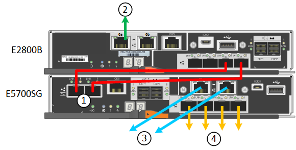

= Appliance pour câble (SG5700)
:allow-uri-read: 
:icons: font
:imagesdir: ../media/

[role="lead"]
Vous connectez les deux contrôleurs, connectez les ports de gestion de chaque contrôleur et connectez les ports 10/25-GbE du contrôleur E5700SG au réseau Grid et au réseau client en option pour StorageGRID.

.Avant de commencer
* Vous avez déballé les éléments suivants, fournis avec l'appareil :
+
** Deux cordons d'alimentation.
** Deux câbles optiques pour les ports d'interconnexion FC sur les contrôleurs.
** Huit émetteurs-récepteurs SFP+ prenant en charge le protocole FC 10 GbE ou 16 Gbit/s. Les émetteurs-récepteurs peuvent être utilisés avec les deux ports d'interconnexion des deux contrôleurs et avec les quatre ports réseau 10/25 GbE du contrôleur E5700SG, à condition que vous souhaitiez que les ports réseau utilisent une vitesse de liaison 10 GbE.

* Vous avez obtenu les éléments suivants, qui ne sont pas fournis avec l'appareil :
+
** Un à quatre câbles optiques pour les ports 10/25 GbE que vous prévoyez d'utiliser.
** Un à quatre émetteurs-récepteurs SFP28 si vous prévoyez d'utiliser une vitesse de liaison 25 GbE.
** Câbles Ethernet pour la connexion des ports de gestion.

CAUTION: *Risque d'exposition au rayonnement laser* -- ne démontez ou ne retirez aucune partie d'un émetteur-récepteur SFP. Vous pourriez être exposé à un rayonnement laser.

.Description de la tâche
Les chiffres montrent les deux contrôleurs des modèles SG5760 et S260X, avec le contrôleur de stockage de la gamme E2800 en haut et le contrôleur E5700SG en bas. Dans le SG5712 et dans la résolution 12X, le contrôleur de stockage de la gamme E2800 se trouve à gauche du contrôleur E5700SG, lorsqu'il est vue depuis l'arrière.

Connexions SG5760 :

image::../media/sg5760_connections.gif[Connexions sur l'appliance SG5760]

Connexions SG5760X :

[cols="1a,2a,2a,2a"]
|===
| Légende | Port | Type de port | Utiliser 

 a| 
1
 a| 
Deux ports d'interconnexion sur chaque contrôleur
 a| 
SFP+ optique 16 Gbit/s FC
 a| 
Connectez les deux contrôleurs les uns aux autres.

 a| 
2
 a| 
Port de gestion 1 sur le contrôleur E2800 Series
 a| 
1 GbE (RJ-45)
 a| 
Connexion au réseau sur lequel vous accédez à SANtricity System Manager. Vous pouvez utiliser le réseau d'administration pour StorageGRID ou un réseau de gestion indépendant.

 a| 
2
 a| 
Port de gestion 2 sur le contrôleur E2800 Series
 a| 
1 GbE (RJ-45)
 a| 
Réservé au support technique.

 a| 
3
 a| 
Port de gestion 1 du contrôleur E5700SG
 a| 
1 GbE (RJ-45)
 a| 
Permet de connecter le contrôleur E5700SG au réseau d'administration pour StorageGRID.

 a| 
3
 a| 
Port de gestion 2 du contrôleur E5700SG
 a| 
1 GbE (RJ-45)
 a| 
* Peut être lié avec le port de gestion 1 si vous souhaitez établir une connexion redondante avec le réseau d'administration.
* Peut être laissé sans fil et disponible pour un accès local temporaire (IP 169.254.0.1).
* Lors de l'installation, peut être utilisé pour connecter le contrôleur E5700SG à un ordinateur portable de service si les adresses IP attribuées par DHCP ne sont pas disponibles.

 a| 
4
 a| 
Ports 10/25 GbE 1-4 sur le contrôleur E5700SG
 a| 
10 GbE ou 25 GbE

*Remarque :* les émetteurs-récepteurs SFP+ inclus avec l'appareil prennent en charge les vitesses de liaison 10 GbE. Si vous souhaitez utiliser des vitesses de liaison 25 GbE pour les quatre ports réseau, vous devez fournir des émetteurs-récepteurs SFP28.
 a| 
Connectez-vous au réseau Grid et au réseau client pour StorageGRID. Voir link:port-bond-modes-for-e5700sg-controller-ports.html["Modes de liaison des ports (contrôleur E5700SG)"].

|===
.Étapes
. Connectez le contrôleur E2800 au contrôleur E5700SG à l'aide de deux câbles optiques et de quatre des huit émetteurs-récepteurs SFP+.
+
[cols="1a,1a"]
|===
| Connecter ce port... | Vers ce port... 

 a| 
Port d'interconnexion 1 du contrôleur E2800
 a| 
Port d'interconnexion 1 du contrôleur E5700SG

 a| 
Port d'interconnexion 2 du contrôleur E2800
 a| 
Port d'interconnexion 2 du contrôleur E5700SG

|===
. Si vous prévoyez d'utiliser SANtricity System Manager, connectez le port de gestion 1 (P1) du contrôleur E2800 (port RJ-45 de gauche) au réseau de gestion de SANtricity System Manager à l'aide d'un câble Ethernet.
+
N'utilisez pas le port de gestion 2 (P2) du contrôleur E2800 (port RJ-45 sur la droite). Ce port est réservé au support technique.

. Si vous avez l'intention d'utiliser le réseau d'administration pour StorageGRID, connectez le port de gestion 1 du contrôleur E5700SG (le port RJ-45 sur la gauche) au réseau d'administration à l'aide d'un câble Ethernet.
+
Si vous avez l'intention d'utiliser le mode de liaison réseau de sauvegarde active pour le réseau d'administration, connectez le port de gestion 2 du contrôleur E5700SG (le port RJ-45 sur la droite) au réseau d'administration à l'aide d'un câble Ethernet.

. Connectez les ports 10/25 GbE du contrôleur E5700SG aux switchs réseau appropriés, à l'aide de câbles optiques et d'émetteurs-récepteurs SFP+ ou SFP28.
+

NOTE: Tous les ports doivent utiliser la même vitesse de liaison. Installez des émetteurs-récepteurs SFP+ si vous prévoyez d'utiliser des vitesses de liaison 10 GbE. Installez des émetteurs-récepteurs SFP28 si vous prévoyez d'utiliser des vitesses de liaison 25 GbE.

+
** Si vous prévoyez d'utiliser le mode de liaison de port fixe (par défaut), connectez les ports aux réseaux StorageGRID Grid et client, comme indiqué dans le tableau.
+
[cols="1a,1a"]
|===
| Port | Se connecte à... 

 a| 
Orifice 1
 a| 
Réseau client (facultatif)

 a| 
Orifice 2
 a| 
Réseau Grid

 a| 
Orifice 3
 a| 
Réseau client (facultatif)

 a| 
Orifice 4
 a| 
Réseau Grid

|===
** Si vous prévoyez d'utiliser le mode de liaison du port de l'agrégat, connectez un ou plusieurs ports réseau à un ou plusieurs commutateurs. Vous devez connecter au moins deux des quatre ports pour éviter d'avoir un point de défaillance unique. Si vous utilisez plusieurs switchs pour une liaison LACP unique, les switchs doivent prendre en charge MLAG ou équivalent.

.Informations associées
link:accessing-storagegrid-appliance-installer.html["Accédez au programme d'installation de l'appliance StorageGRID"]
