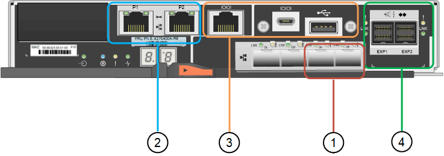

= Contrôleurs SG5700
:allow-uri-read: 
:icons: font
:imagesdir: ../media/

[role="lead"]
Les modèles SG5712 et SAP12X de 12 disques ainsi que SG5760 et S10X de 60 disques de l'appliance StorageGRID incluent un contrôleur de calcul E5700SG et un contrôleur de stockage E-Series E2800.

* Le SG5712 et SG5760 utilisent un contrôleur E2800A.
* Le modèle U112X et le modèle UB60X utilisent un contrôleur E2800B.

Les contrôleurs E2800A et E2800B sont identiques en termes de spécifications et de fonctions, sauf pour l'emplacement des ports d'interconnexion.

== Contrôleur de calcul E5700SG

* Fonctionne comme serveur de calcul pour l'appliance.
* Inclut le programme d'installation de l'appliance StorageGRID.
+

NOTE: Le logiciel StorageGRID n'est pas préinstallé sur l'appliance. Lors du déploiement de l'appliance, il est possible d'accéder à ce logiciel à partir du nœud d'administration.

* Peut se connecter aux trois réseaux StorageGRID, y compris le réseau Grid, le réseau d'administration et le réseau client.
* Connexion au contrôleur E2800 et fonctionne comme initiateur.

=== Connecteurs E5700SG

image::../media/e5700sg_controller_with_callouts.gif[Connecteurs du contrôleur E5700SG]

[cols="1a,2a,2a,2a"]
|===
| Légende | Port | Type | Utiliser 

 a| 
1
 a| 
Ports d'interconnexion 1 et 2
 a| 
Fibre Channel (FC) de 16 Gbit/s, SFP optique
 a| 
Connectez le contrôleur E5700SG au contrôleur E2800.

 a| 
2
 a| 
Ports de diagnostic et de support
 a| 
* Port série RJ-45
* Port série micro USB
* Port USB

 a| 
Réservé au support technique.

 a| 
3
 a| 
Ports d'extension de disque
 a| 
12 Gb/s SAS
 a| 
Non utilisé. Les appliances StorageGRID ne prennent pas en charge les tiroirs disques d'extension.

 a| 
4
 a| 
Ports réseau 1-4
 a| 
10 GbE ou 25 GbE, selon le type d'émetteur-récepteur SFP, la vitesse du commutateur et la vitesse de liaison configurée
 a| 
Connectez-vous au réseau Grid et au réseau client pour StorageGRID.

 a| 
5
 a| 
Port de gestion 1
 a| 
Ethernet 1 Gbit (RJ-45)
 a| 
Connectez-vous au réseau d'administration pour StorageGRID.

 a| 
6
 a| 
Port de gestion 2
 a| 
Ethernet 1 Gbit (RJ-45)
 a| 
Options :

* Lien avec le port de gestion 1 pour une connexion redondante au réseau d'administration pour StorageGRID.
* Laissez sans fil et disponible pour l'accès local temporaire (IP 169.254.0.1).
* Lors de l'installation, utilisez le port 2 pour la configuration IP si les adresses IP attribuées par DHCP ne sont pas disponibles.

|===

== Contrôleur de stockage E2800

Deux versions du contrôleur de stockage E2800 sont utilisées dans les appliances SG5700 : E2800A et E2800B. Le E2800A n'a pas de HIC et le E2800B est équipé d'une HIC à quatre ports. Les deux versions de contrôleur ont des spécifications et des fonctions identiques, à l'exception de l'emplacement des ports d'interconnexion.

Le contrôleur de stockage E2800 Series présente les caractéristiques suivantes :

* Fonctionne comme contrôleur de stockage pour l'appliance.
* Gère le stockage des données sur les disques.
* Fonctionne en tant que contrôleur E-Series standard en mode simplex.
* Inclut le logiciel SANtricity OS (firmware du contrôleur).
* Inclut SANtricity System Manager pour le matériel de l'appliance de surveillance, la gestion des alertes, la fonction AutoSupport et la sécurité des lecteurs.
* Se connecte au contrôleur E5700SG et fonctionne comme cible.

=== Connecteurs E2800A

image::../media/e2800_controller_with_callouts.gif[Connecteurs sur contrôleur E2800A]

=== Connecteurs E2800B

[cols="1a,2a,2a,2a"]
|===
| Légende | Port | Type | Utiliser 

 a| 
1
 a| 
Ports d'interconnexion 1 et 2
 a| 
SFP optique FC 16 Gbit/s
 a| 
Connectez le contrôleur E2800 au contrôleur E5700SG.

 a| 
2
 a| 
Ports de gestion 1 et 2
 a| 
Ethernet 1 Gbit (RJ-45)
 a| 
* Options du port 1 :
+
** Connectez-vous à un réseau de gestion pour activer l'accès TCP/IP direct à SANtricity System Manager
** Laissez le câble non câblé pour enregistrer un port de commutateur et une adresse IP. Accédez à SANtricity System Manager à l'aide des interfaces utilisateur Grid Manager ou Storage Grid Appliance installer.

*Remarque* : certaines fonctionnalités SANtricity en option, telles que la synchronisation NTP pour des horodatages précis du journal, ne sont pas disponibles lorsque vous choisissez de laisser le port 1 sans fil.

*Remarque* : StorageGRID 11.5 ou supérieur et SANtricity 11.70 ou supérieur sont nécessaires lorsque vous quittez le port 1 sans fil.

* Le port 2 est réservé au support technique.

 a| 
3
 a| 
Ports de diagnostic et de support
 a| 
* Port série RJ-45
* Port série micro USB
* Port USB

 a| 
Réservé au support technique.

 a| 
4
 a| 
Ports d'extension de disque.
 a| 
12 Gb/s SAS
 a| 
Non utilisé.

|===