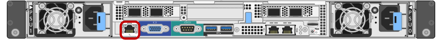

= Collecte des informations d'installation (SG100 et SG1000)
:allow-uri-read: 
:icons: font
:imagesdir: ../media/

[role="lead"]
À l'aide des tableaux, notez les informations requises pour chaque réseau que vous connectez à l'appliance. Ces valeurs sont nécessaires pour installer et configurer le matériel.

TIP: Au lieu d'utiliser les tableaux, utilisez le manuel fourni avec ConfigBuilder. Le manuel ConfigBuilder vous permet de télécharger les informations système et de générer un fichier JSON pour effectuer automatiquement certaines étapes de configuration dans le programme d'installation de l'appliance StorageGRID. Voir link:automating-appliance-installation-and-configuration.html["Automatisez l'installation et la configuration de l'appliance"].

== Vérifiez la version de StorageGRID

Avant d'installer une appliance de services SG100 ou SG1000, vérifiez que votre système StorageGRID utilise la version requise du logiciel StorageGRID.

[cols="1a,2a"]
|===
| Appliance | Version StorageGRID requise 

 a| 
SG1000
 a| 
11.3 ou ultérieure (dernier correctif recommandé)

 a| 
SG100
 a| 
11.4 ou ultérieure (dernier correctif recommandé)

|===

== Ports d'administration et de maintenance

Le réseau d'administration pour StorageGRID est un réseau facultatif, utilisé pour l'administration et la maintenance du système. L'appliance se connecte au réseau d'administration à l'aide des ports de gestion 1 GbE suivants de l'appliance.

Ports RJ-45 SG100 :

image::../media/sg100_rj_45_ports_circled.png[Ports RJ-45 SG100]

Ports RJ-45 SG1000 :

image::../media/sg1000_rj_45_ports_circled.png[Ports RJ-45 SG1000]

[cols="2a,1a"]
|===
| Informations nécessaires | Votre valeur 

 a| 
Réseau admin activé
 a| 
Choisir une option :

* Non
* Oui (par défaut)

 a| 
Mode de liaison réseau
 a| 
Choisir une option :

* Indépendant (par défaut)
* Sauvegarde active-Backup

 a| 
Port de commutateur pour le port gauche entouré dans le schéma (port actif par défaut pour le mode de liaison réseau indépendante)
 a| 

 a| 
Port de commutateur pour le port droit entouré dans le diagramme (mode de liaison réseau Active-Backup uniquement)
 a| 

 a| 
Adresse MAC du port réseau d'administration

*Remarque :* l'étiquette d'adresse MAC située à l'avant de l'appliance répertorie l'adresse MAC du port de gestion BMC. Pour déterminer l'adresse MAC du port Admin Network, ajoutez *2* au nombre hexadécimal figurant sur l'étiquette. Par exemple, si l'adresse MAC de l'étiquette se termine par *09*, l'adresse MAC du port d'administration se terminera par *0B*. Si l'adresse MAC de l'étiquette se termine dans *(_y_)FF*, l'adresse MAC du port d'administration se terminera dans *(_y_+1)01*. Vous pouvez facilement effectuer ce calcul en ouvrant Calculator sous Windows, en le définissant en mode programmateur, en sélectionnant Hex, en saisissant l'adresse MAC, puis en tapant *+ 2 =*.
 a| 

 a| 
Adresse IP attribuée par DHCP pour le port réseau d'administration, si disponible après la mise sous tension

*Remarque :* vous pouvez déterminer l'adresse IP attribuée par DHCP en utilisant l'adresse MAC pour rechercher l'adresse IP attribuée.
 a| 
* Adresse IPv4 (CIDR) :
* Passerelle :

 a| 
Adresse IP statique que vous envisagez d'utiliser pour le nœud d'appliance sur le réseau d'administration

*Remarque :* si votre réseau n'a pas de passerelle, spécifiez la même adresse IPv4 statique pour la passerelle.
 a| 
* Adresse IPv4 (CIDR) :
* Passerelle :

 a| 
Sous-réseaux du réseau d'administration (CIDR)
 a| 

|===

== Ports réseau

Les quatre ports réseau de l'appliance se connectent au réseau StorageGRID Grid et au réseau client en option.

[cols="2a,1a"]
|===
| Informations nécessaires | Votre valeur 

 a| 
Vitesse de liaison
 a| 
Pour le SG100, choisissez l'une des options suivantes :

* Auto (par défaut)
* 10 GbE
* 25 GbE

Pour le SG1000, choisissez l'une des options suivantes :

* Auto (par défaut)
* 10 GbE
* 25 GbE
* 40 GbE
* 100 GbE

*Remarque :* pour les vitesses SG1000, 10 et 25 GbE, il faut utiliser des adaptateurs QSA.

 a| 
Mode de liaison du port
 a| 
Choisir une option :

* Fixe (par défaut)
* Agrégat

 a| 
Port de commutation pour le port 1 (réseau client pour mode fixe)
 a| 

 a| 
Port de commutation pour le port 2 (réseau grille pour mode fixe)
 a| 

 a| 
Port de commutation pour le port 3 (réseau client pour mode fixe)
 a| 

 a| 
Port de commutation pour le port 4 (réseau Grid pour mode fixe)
 a| 

|===

== Ports réseau de la grille

Le réseau Grid Network pour StorageGRID est un réseau requis, utilisé pour l'ensemble du trafic StorageGRID interne. L'appliance se connecte au réseau Grid à l'aide des quatre ports réseau.

[cols="2a,1a"]
|===
| Informations nécessaires | Votre valeur 

 a| 
Mode de liaison réseau
 a| 
Choisir une option :

* Sauvegarde active/active (par défaut)
* LACP (802.3ad)

 a| 
Balisage VLAN activé
 a| 
Choisir une option :

* Non (par défaut)
* Oui.

 a| 
Balise VLAN (si le marquage VLAN est activé)
 a| 
Entrez une valeur comprise entre 0 et 4095 :

 a| 
Adresse IP attribuée par DHCP pour le réseau Grid, si disponible après la mise sous tension
 a| 
* Adresse IPv4 (CIDR) :
* Passerelle :

 a| 
Adresse IP statique que vous prévoyez d'utiliser pour le nœud de l'appliance sur le réseau Grid

*Remarque :* si votre réseau n'a pas de passerelle, spécifiez la même adresse IPv4 statique pour la passerelle.
 a| 
* Adresse IPv4 (CIDR) :
* Passerelle :

 a| 
Sous-réseaux du réseau de grille (CIDR)
 a| 

 a| 
Paramètre MTU (maximum transmission Unit) (facultatif)vous pouvez utiliser la valeur par défaut de 1500, ou définir la MTU sur une valeur adaptée aux trames jumbo, comme 9000.
 a| 

|===

== Ports réseau client

Le réseau client pour StorageGRID est un réseau facultatif, généralement utilisé pour fournir l'accès du protocole client à la grille. Le serveur se connecte au réseau client à l'aide des quatre ports réseau.

[cols="2a,1a"]
|===
| Informations nécessaires | Votre valeur 

 a| 
Réseau client activé
 a| 
Choisir une option :

* Non (par défaut)
* Oui.

 a| 
Mode de liaison réseau
 a| 
Choisir une option :

* Sauvegarde active/active (par défaut)
* LACP (802.3ad)

 a| 
Balisage VLAN activé
 a| 
Choisir une option :

* Non (par défaut)
* Oui.

 a| 
Balise VLAN (si le balisage VLAN est activé)
 a| 
Entrez une valeur comprise entre 0 et 4095 :

 a| 
Adresse IP attribuée par DHCP pour le réseau client, si disponible après la mise sous tension
 a| 
* Adresse IPv4 (CIDR) :
* Passerelle :

 a| 
Adresse IP statique que vous prévoyez d'utiliser pour le nœud de l'appliance sur le réseau client

*Remarque :* si le réseau client est activé, la route par défaut du serveur utilise la passerelle indiquée ici.
 a| 
* Adresse IPv4 (CIDR) :
* Passerelle :

|===

== Ports réseau de gestion BMC

Vous pouvez accéder à l'interface BMC de l'appliance de services à l'aide du port de gestion 1 GbE entouré dans le schéma. Ce port prend en charge la gestion à distance du matériel du contrôleur via Ethernet en utilisant la norme IPMI (Intelligent Platform Management interface).

NOTE: Vous pouvez activer ou désactiver l'accès IPMI à distance pour tous les dispositifs contenant un contrôleur BMC en utilisant le point de terminaison privé de l'API de gestion, PUT /private/bmc.

Port de gestion du contrôleur BMC SG100 :

Port de gestion du contrôleur BMC SG1000 :

image::../media/sg1000_bmc_management_port.png[Port de gestion BMC SG1000]

[cols="2a,1a"]
|===
| Informations nécessaires | Votre valeur 

 a| 
Port de commutateur Ethernet vous vous connectez au port de gestion du contrôleur BMC (encerclé dans le diagramme)
 a| 

 a| 
Adresse IP attribuée par DHCP pour le réseau de gestion BMC, si disponible après la mise sous tension
 a| 
* Adresse IPv4 (CIDR) :
* Passerelle :

 a| 
Adresse IP statique que vous prévoyez d'utiliser pour le port de gestion BMC
 a| 
* Adresse IPv4 (CIDR) :
* Passerelle :

|===
.Informations associées
* link:cabling-appliance-sg100-and-sg1000.html["Cable appliance (SG100 et SG1000)"]
* link:setting-ip-configuration.html["Configurez les adresses IP StorageGRID"]

