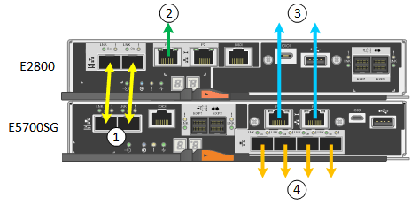

= Connexions réseau (SG5700)
:allow-uri-read: 
:icons: font
:imagesdir: ../media/

[role="lead"]
Lorsque vous installez une appliance SG5700 StorageGRID, vous connectez les deux contrôleurs les uns aux autres et aux réseaux requis.

La figure montre les deux contrôleurs SG5760, avec le contrôleur E2800 en haut et le contrôleur E5700SG en bas. Dans le SG5712, le contrôleur E2800 est à la gauche du contrôleur E5700SG.

[cols="1a,2a,2a,2a"]
|===
| Légende | Port | Type de port | Utiliser 

 a| 
1
 a| 
Deux ports d'interconnexion sur chaque contrôleur
 a| 
SFP+ optique 16 Gbit/s FC
 a| 
Connectez les deux contrôleurs les uns aux autres.

 a| 
2
 a| 
Port de gestion 1 du contrôleur E2800
 a| 
1 GbE (RJ-45)
 a| 
Connexion au réseau sur lequel vous accédez à SANtricity System Manager. Vous pouvez utiliser le réseau d'administration pour StorageGRID ou un réseau de gestion indépendant.

 a| 
Port de gestion 2 du contrôleur E2800
 a| 
1 GbE (RJ-45)
 a| 
Réservé au support technique.

 a| 
3
 a| 
Port de gestion 1 du contrôleur E5700SG
 a| 
1 GbE (RJ-45)
 a| 
Permet de connecter le contrôleur E5700SG au réseau d'administration pour StorageGRID.

 a| 
Port de gestion 2 du contrôleur E5700SG
 a| 
1 GbE (RJ-45)
 a| 
* Peut être lié avec le port de gestion 1 si vous souhaitez établir une connexion redondante avec le réseau d'administration.
* Peut être laissé sans fil et disponible pour un accès local temporaire (IP 169.254.0.1).
* Lors de l'installation, peut être utilisé pour connecter le contrôleur E5700SG à un ordinateur portable de service si les adresses IP attribuées par DHCP ne sont pas disponibles.

 a| 
4
 a| 
Ports 10/25 GbE 1-4 sur le contrôleur E5700SG
 a| 
10 GbE ou 25 GbE

*Remarque :* les émetteurs-récepteurs SFP+ inclus avec l'appareil prennent en charge les vitesses de liaison 10 GbE. Si vous souhaitez utiliser des vitesses de liaison 25 GbE pour les quatre ports réseau, vous devez fournir des émetteurs-récepteurs SFP28.
 a| 
Connectez-vous au réseau Grid et au réseau client pour StorageGRID. Voir link:port-bond-modes-for-e5700sg-controller-ports.html["Modes de liaison des ports (contrôleur E5700SG)"].

|===