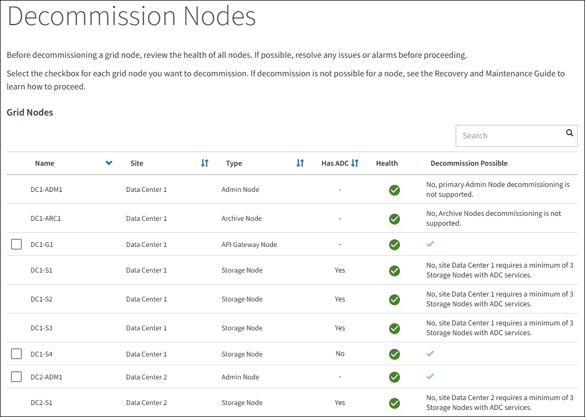

= Accédez à la page nœuds de mise hors service
:allow-uri-read: 
:icons: font
:imagesdir: ../media/

[role="lead"]
Lorsque vous accédez à la page Decommission Nodes dans Grid Manager, vous pouvez voir en un coup d'œil quels nœuds peuvent être désaffectés.

.Avant de commencer
* Vous êtes connecté au Grid Manager à l'aide d'un link:../admin/web-browser-requirements.html["navigateur web pris en charge"].
* Vous disposez de l'autorisation Maintenance ou accès racine.

.Étapes
. Sélectionnez *MAINTENANCE* > *tâches* > *désaffectation*.
. Sélectionnez *nœuds de mise hors service*.
+
La page nœuds de mise hors service s'affiche. À partir de cette page, vous pouvez :

+
** Déterminez les nœuds de la grille qui peuvent être désaffectés.
** Voir l'état de santé de tous les nœuds de la grille
** Triez la liste par ordre croissant ou décroissant en fonction de *Nom*, *site*, *Type* ou *a ADC*.
** Entrez des termes de recherche pour trouver rapidement des nœuds spécifiques. Par exemple, cette page affiche les nœuds grid dans deux data centers. La colonne Decommission possible indique que vous pouvez désaffecter le nœud de passerelle, l'un des cinq nœuds de stockage et le nœud d'administration non primaire.

+

. Consultez la colonne *Decommission possible* pour chaque nœud que vous souhaitez désaffecter.
+
Si un nœud de grid peut être désaffecté, cette colonne est cochée en vert, et la colonne de gauche inclut une case à cocher. Si un nœud ne peut pas être désaffecté, cette colonne décrit le problème. S'il existe plusieurs raisons pour lesquelles un nœud ne peut pas être désaffecté, la raison la plus critique s'affiche.

+
[cols="1a,1a,1a"]
|===
| Motif de mise hors service possible | Description | Étapes à résoudre 

 a| 
Non, la mise hors service du type de nœud n'est pas prise en charge.
 a| 
Vous ne pouvez pas désaffecter le nœud d'administration principal ou un nœud d'archivage.
 a| 
Aucune.

 a| 
Non, au moins un nœud de la grille est déconnecté.

*Remarque :* ce message s'affiche uniquement pour les nœuds de grille connectés.
 a| 
Vous ne pouvez pas désaffecter un nœud de grid connecté si un nœud de grid est déconnecté.

La colonne *Santé* comprend l'une des icônes suivantes pour les nœuds de grille déconnectés :

** image:../media/icon_alarm_gray_administratively_down.png["icône questionmark grise"] (Gris) : arrêt administratif
** image:../media/icon_alarm_blue_unknown.png["icône bleue du point d'interrogation"] (Bleu) : inconnu

 a| 
Accédez au <<decommission_procedure_choices,étape qui répertorie les choix de procédure de mise hors service>>.

 a| 
Non, un ou plusieurs nœuds requis sont actuellement déconnectés et doivent être restaurés.

*Remarque :* ce message s'affiche uniquement pour les nœuds de grille déconnectés.
 a| 
Vous ne pouvez pas désaffecter un nœud de grille déconnecté si un ou plusieurs nœuds requis sont également déconnectés (par exemple, un nœud de stockage requis pour le quorum ADC).
 a| 
.. Consultez les messages de mise hors service possibles pour tous les nœuds déconnectés.
.. Déterminez les nœuds qui ne peuvent pas être désaffectés, car ils sont requis.
+
*** Si l'état de santé d'un nœud requis est désactivé d'un point de vue administratif, remettre le nœud en ligne.
*** Si l'état de santé d'un nœud requis n'est pas connu, effectuez une procédure de restauration de nœud pour restaurer le nœud requis.

 a| 
Non, membre du(des) groupe(s) HA: _X_. Avant de pouvoir désaffecter ce nœud, vous devez le supprimer de tous les groupes haute disponibilité.
 a| 
Vous ne pouvez pas désaffecter un nœud d'administration ou un nœud de passerelle si une interface de nœud appartient à un groupe haute disponibilité (HA).
 a| 
Modifiez le groupe haute disponibilité pour supprimer l'interface du nœud ou supprimer l'ensemble du groupe haute disponibilité. Reportez-vous aux instructions pour link:../admin/index.html["Administration d'StorageGRID"].

 a| 
Non, site _x_ nécessite au moins _n_ nœuds de stockage avec services ADC.
 a| 
*Nœuds de stockage uniquement.* vous ne pouvez pas désaffecter un nœud de stockage si un nombre insuffisant de nœuds resterait sur le site pour prendre en charge les exigences de quorum ADC.
 a| 
Procédez à une extension. Ajoutez un nouveau nœud de stockage au site et spécifiez qu'il doit disposer d'un service ADC. Voir les informations sur le link:understanding-adc-service-quorum.html["Quorum ADC"].

 a| 
Non, un ou plusieurs profils de code d'effacement nécessitent au moins _n_ nœuds de stockage. Si le profil n'est pas utilisé dans une règle ILM, vous pouvez le désactiver.
 a| 
*Nœuds de stockage uniquement.* vous ne pouvez pas désaffecter un nœud de stockage à moins qu'il ne reste suffisamment de nœuds pour les profils de code d'effacement existants.

Par exemple, si un profil de code d'effacement existe pour un code d'effacement 4+2, au moins 6 nœuds de stockage doivent rester.
 a| 
Pour chaque profil de code d'effacement concerné, effectuez l'une des opérations suivantes en fonction de l'utilisation du profil :

** *Utilisé dans la politique ILM active* : réaliser une expansion. Ajoutez suffisamment de nœuds de stockage pour que le code d'effacement puisse continuer. Reportez-vous aux instructions pour link:../expand/index.html["extension de votre grille"].
** *Utilisé dans une règle ILM mais pas dans la règle ILM active* : modifiez ou supprimez la règle, puis désactivez le profil de code d'effacement.
** *Non utilisé dans une règle ILM* : désactive le profil de code d'effacement.

*Remarque :* un message d'erreur s'affiche si vous tentez de désactiver un profil de code d'effacement et que les données d'objet sont toujours associées au profil. Vous devrez peut-être attendre plusieurs semaines avant d'essayer à nouveau le processus de désactivation.

Pour en savoir plus sur la désactivation d'un profil de code d'effacement, reportez-vous aux instructions de link:../ilm/index.html["Gestion des objets avec ILM"].

|===
. [[désaffecter_Procedure_Choices]]si le déclassement est possible pour le nœud, déterminez quelle procédure vous devez effectuer :
+
[cols="1a,1a"]
|===
| Si votre grille inclut... | Aller à... 

 a| 
Tous les nœuds de la grille déconnectés
 a| 
link:decommissioning-disconnected-grid-nodes.html["Désaffectation des nœuds de la grille déconnectés"]

 a| 
Nœuds grid connectés uniquement
 a| 
link:decommissioning-connected-grid-nodes.html["Désaffectation des nœuds connectés"]

|===

