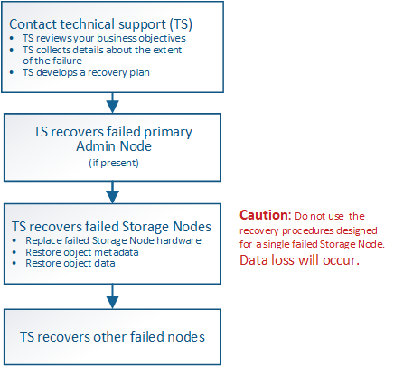

= Comment la reprise sur site est effectuée par le support technique
:allow-uri-read: 
:icons: font
:imagesdir: ../media/

[role="lead"]
Si l'ensemble du site StorageGRID tombe en panne ou si plusieurs nœuds de stockage tombent en panne, vous devez contacter le support technique. Le support technique évalue votre situation, développe un plan de reprise, puis restaure les nœuds ou le site en panne en fonction des objectifs de votre entreprise, optimise le délai de restauration et évite les pertes de données inutiles.

CAUTION: La restauration du site ne peut être effectuée que par le support technique.

Les systèmes StorageGRID sont résilients pour de nombreuses défaillances et vous pouvez réaliser vous-même de nombreuses procédures de reprise et de maintenance. Cependant, il est difficile de créer une procédure simple et généralisée de récupération du site parce que les étapes détaillées dépendent de facteurs spécifiques à votre situation. Par exemple :

* *Vos objectifs d'entreprise*: Après la perte complète d'un site StorageGRID, vous devriez évaluer la meilleure façon d'atteindre vos objectifs d'entreprise. Par exemple, voulez-vous reconstruire le site perdu en place? Voulez-vous remplacer le site StorageGRID perdu à un nouvel emplacement ? La situation de chaque client est différente, et votre plan de reprise doit être conçu pour répondre à vos priorités.
* *Nature exacte de la défaillance* : avant de commencer une récupération de site, déterminez si des nœuds du site défaillant sont intacts ou si des nœuds de stockage contiennent des objets récupérables. Si vous reconstruisez des nœuds ou des volumes de stockage contenant des données valides, vous risquez de perdre des données superflues.
* *Politique ILM active* : le nombre, le type et l'emplacement des copies d'objet dans votre grille sont contrôlés par votre politique ILM active. Les spécificités de votre politique ILM peuvent affecter la quantité de données récupérables, ainsi que les techniques spécifiques requises pour la restauration.
+

CAUTION: Si un site contient la seule copie d'un objet et que le site est perdu, l'objet est perdu.

* *Cohérence du compartiment (ou du conteneur)* : le niveau de cohérence appliqué à un compartiment (ou à un conteneur) affecte si StorageGRID réplique intégralement les métadonnées d'objet vers tous les nœuds et sites avant de dire à un client que l'ingestion de l'objet a réussi. Si votre niveau de cohérence permet une éventuelle cohérence, certaines métadonnées d'objet peuvent être perdues en cas de défaillance du site. Cela peut avoir un impact sur la quantité de données récupérables et éventuellement sur les détails de la procédure de restauration.
* *Historique des changements récents*: Les détails de votre procédure de récupération peuvent être affectés par la question de savoir si des procédures de maintenance étaient en cours au moment de l'échec ou si des modifications récentes ont été apportées à votre politique ILM. Le support technique doit évaluer l'historique récent de votre grille ainsi que sa situation actuelle avant de commencer une récupération de site.

== Présentation de la récupération de site

Il s'agit d'une présentation générale de la procédure utilisée par le support technique pour restaurer un site en panne.

CAUTION: La restauration du site ne peut être effectuée que par le support technique.

. Contactez l'assistance technique.
+
Le support technique évalue en détail la défaillance et travaille avec vous pour examiner les objectifs de votre entreprise. Sur la base de ces informations, le support technique développe un plan de reprise sur incident adapté à votre situation.

. Le support technique restaure le nœud d'administration principal s'il est défectueux.
. Support technique pour la restauration de tous les nœuds de stockage, voici les grandes lignes :
+
.. Remplacez le matériel ou les machines virtuelles du nœud de stockage selon les besoins.
.. Restaurez les métadonnées d'objet sur le site défaillant.
.. Restaurez les données d'objet vers les nœuds de stockage récupérés.
+

CAUTION: La perte de données se produit si les procédures de restauration d'un seul nœud de stockage défaillant sont utilisées.

+

NOTE: Lorsqu'un site entier présente une défaillance, des commandes spécialisées sont nécessaires pour restaurer correctement les objets et les métadonnées d'objet.

. Le support technique restaure les autres nœuds défaillants.
+
Une fois les métadonnées et les données d'objet restaurées, des nœuds de passerelle défaillants, ainsi que des nœuds d'administration non primaires et des nœuds d'archivage peuvent être restaurés à l'aide des procédures standard.

.Informations associées
link:site-decommissioning.html["Mise hors service du site"]
