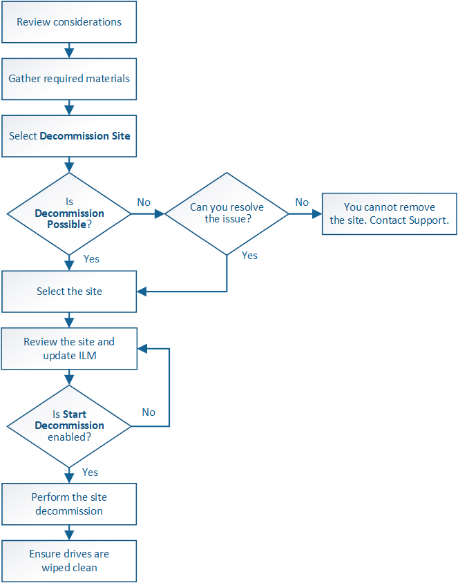

= Désaffectation du site : présentation
:allow-uri-read: 
:icons: font
:imagesdir: ../media/

[role="lead"]
Il se peut que vous deviez supprimer un site de data Center du système StorageGRID. Pour supprimer un site, vous devez le mettre hors service.

L'organigramme présente les étapes générales de la mise hors service d'un site.

