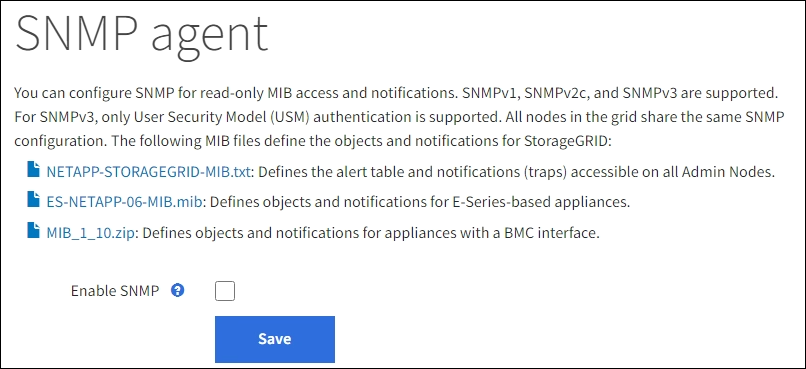
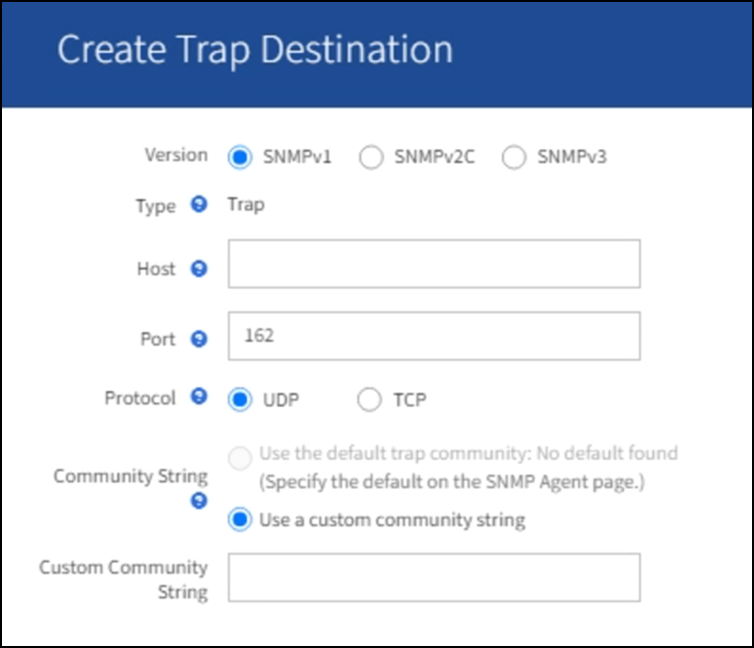

= Configurez l'agent SNMP
:allow-uri-read: 
:icons: font
:imagesdir: ../media/

[role="lead"]
Vous pouvez configurer l'agent SNMP StorageGRID si vous souhaitez utiliser un système de gestion SNMP tiers pour l'accès MIB en lecture seule et les notifications.

.Avant de commencer
* Vous êtes connecté au Grid Manager à l'aide d'un link:../admin/web-browser-requirements.html["navigateur web pris en charge"].
* Vous disposez de l'autorisation d'accès racine.

.Description de la tâche
L'agent SNMP StorageGRID prend en charge les trois versions du protocole SNMP. Vous pouvez configurer l'agent pour une ou plusieurs versions.

.Étapes
. Sélectionnez *CONFIGURATION* > *surveillance* > *agent SNMP*.
+
La page agent SNMP s'affiche.

+

. Pour activer l'agent SNMP sur tous les nœuds de la grille, cochez la case *Activer SNMP*.
+
Les champs de configuration d'un agent SNMP s'affichent.

+
image::../media/snmp_agent_page.png[Page agent SNMP]

. Dans le champ *Contact système*, entrez la valeur que vous souhaitez que StorageGRID vous apporte dans les messages SNMP pour sysContact.
+
Le contact système est généralement une adresse e-mail. La valeur indiquée s'applique à tous les nœuds du système StorageGRID. *Contact système* peut comporter un maximum de 255 caractères.

. Dans le champ *emplacement du système*, entrez la valeur que vous souhaitez que StorageGRID vous apporte dans les messages SNMP pour sysLocation.
+
L'emplacement du système peut être toute information utile pour identifier l'emplacement de votre système StorageGRID. Par exemple, vous pouvez utiliser l'adresse d'un établissement. La valeur indiquée s'applique à tous les nœuds du système StorageGRID. *Emplacement du système* peut comporter un maximum de 255 caractères.

. Laissez la case *Activer les notifications d'agent SNMP* cochée si vous souhaitez que l'agent SNMP StorageGRID envoie des notifications d'interruption et d'information.
+
Si cette case est décochée, l'agent SNMP prend en charge l'accès MIB en lecture seule, mais n'envoie pas de notifications SNMP.

. Cochez la case *Activer les interruptions d'authentification* si vous souhaitez que l'agent SNMP StorageGRID envoie une interruption d'authentification s'il reçoit un message de protocole authentifié de façon incorrecte.
. Si vous utilisez SNMPv1 ou SNMPv2c, complétez la section chaînes de communauté.
+
Les champs de cette section sont utilisés pour l'authentification communautaire dans SNMPv1 ou SNMPv2c. Ces champs ne s'appliquent pas au protocole SNMPv3.

+
.. Dans le champ *Default Trap Community*, vous pouvez également saisir la chaîne de communauté par défaut que vous souhaitez utiliser pour les destinations de déroutement.
+
Selon les besoins, vous pouvez fournir une autre chaîne de communauté (« personnalisée ») lorsque vous <<select_trap_destination,définir une destination de recouvrement spécifique>>.

+
*Default Trap Community* peut comporter un maximum de 32 caractères et ne peut pas contenir de caractères d'espace.

.. Pour *Read-Only Community*, entrez une ou plusieurs chaînes de communauté pour autoriser l'accès MIB en lecture seule sur les adresses d'agent IPv4 et IPv6. Sélectionnez le signe plus image:../media/icon_plus_sign_black_on_white_old.png["Signe plus"] pour ajouter plusieurs chaînes.
+
Lorsque le système de gestion interroge la MIB StorageGRID, il envoie une chaîne de communauté. Si la chaîne de communauté correspond à l'une des valeurs spécifiées ici, l'agent SNMP envoie une réponse au système de gestion.

+
Chaque chaîne de communauté peut comporter un maximum de 32 caractères et ne peut pas contenir de caractères d'espace. Jusqu'à cinq chaînes sont autorisées.

+

NOTE: Pour assurer la sécurité de votre système StorageGRID, n'utilisez pas « public » comme chaîne de communauté. Si vous n'entrez pas de chaîne de communauté, l'agent SNMP utilise l'ID de grille de votre système StorageGRID comme chaîne de communauté.

. Vous pouvez également sélectionner l'onglet adresses d'agent dans la section autres configurations.
+
Utilisez cet onglet pour spécifier une ou plusieurs « adresses d'écoute ». Ce sont les adresses StorageGRID sur lesquelles l'agent SNMP peut recevoir des requêtes. Chaque adresse de l'agent inclut un protocole Internet, un protocole de transport, un réseau StorageGRID et éventuellement un port.

+
Si vous ne configurez pas d'adresse d'agent, l'adresse d'écoute par défaut est le port UDP 161 sur tous les réseaux StorageGRID.

+
.. Sélectionnez *Créer*.
+
La boîte de dialogue Créer une adresse d'agent s'affiche.

+
image::../media/snmp_create_agent_address.png[Adresse de l'agent SNMP]

.. Pour *Internet Protocol*, indiquez si cette adresse doit utiliser IPv4 ou IPv6.
+
Par défaut, SNMP utilise IPv4.

.. Pour *transport Protocol*, sélectionnez si cette adresse utilisera UDP ou TCP.
+
Par défaut, SNMP utilise UDP.

.. Dans le champ *réseau StorageGRID*, sélectionnez le réseau StorageGRID sur lequel la requête sera reçue.
+
*** Réseau Grid, Admin et client : StorageGRID doit écouter les requêtes SNMP sur les trois réseaux.
*** Réseau Grid
*** Réseau d'administration
*** Réseau client
+

NOTE: Pour vous assurer que les communications client avec StorageGRID restent sécurisées, vous ne devez pas créer d'adresse d'agent pour le réseau client.

.. Dans le champ *Port*, saisissez éventuellement le numéro de port que l'agent SNMP doit écouter.
+
Le port UDP par défaut d'un agent SNMP est 161, mais vous pouvez entrer n'importe quel numéro de port inutilisé.

+

NOTE: Lorsque vous enregistrez l'agent SNMP, StorageGRID ouvre automatiquement les ports d'adresse de l'agent sur le pare-feu interne. Vous devez vous assurer que tous les pare-feu externes autorisent l'accès à ces ports.

.. Sélectionnez *Créer*.
+
L'adresse de l'agent est créée et ajoutée à la table.

+
image::../media/snmp_other_configurations_agent_addresses_table.png[SNMP autres configurations Tableau des adresses des agents]

. Si vous utilisez SNMPv3, sélectionnez l'onglet utilisateurs USM dans la section autres configurations.
+
Utilisez cet onglet pour définir les utilisateurs USM autorisés à interroger la MIB ou à recevoir des interruptions et des informations.

+

NOTE: Cette étape ne s'applique pas si vous utilisez uniquement SNMPv1 ou SNMPv2c.

+
.. Sélectionnez *Créer*.
+
La boîte de dialogue Créer un utilisateur USM s'affiche.

+
image::../media/snmp_create_usm_user.png[Utilisateur SNMP USM]

.. Saisissez un *Nom d'utilisateur* unique pour cet utilisateur USM.
+
Les noms d'utilisateur ont un maximum de 32 caractères et ne peuvent pas contenir de caractères d'espace. Le nom d'utilisateur ne peut pas être modifié après la création de l'utilisateur.

.. Cochez la case *accès MIB en lecture seule* si cet utilisateur doit avoir un accès en lecture seule à la MIB.
+
Si vous sélectionnez *accès MIB en lecture seule*, le champ *ID moteur autorisée* est désactivé.

+

NOTE: Les utilisateurs USM disposant d'un accès MIB en lecture seule ne peuvent pas avoir d'ID de moteur.

.. Si cet utilisateur sera utilisé dans une destination INFORM, saisissez l'ID de moteur * faisant autorité pour cet utilisateur.
+

NOTE: Les destinations SNMPv3 INFORM doivent avoir des utilisateurs avec des ID de moteur. La destination d'interruption SNMPv3 ne peut pas avoir d'utilisateurs avec des ID de moteur.

+
L'ID de moteur faisant autorité peut être de 5 à 32 octets en hexadécimal.

.. Sélectionnez un niveau de sécurité pour l'utilisateur USM.
+
*** *AuthPriv* : cet utilisateur communique avec l'authentification et la confidentialité (cryptage). Vous devez spécifier un protocole d'authentification et un mot de passe ainsi qu'un protocole de confidentialité et un mot de passe.
*** *AuthNoPriv*: Cet utilisateur communique avec l'authentification et sans confidentialité (pas de cryptage). Vous devez spécifier un protocole d'authentification et un mot de passe.

.. Entrez et confirmez le mot de passe que cet utilisateur utilisera pour l'authentification.
+

NOTE: Le seul protocole d'authentification pris en charge est SHA (HMAC-SHA-96).

.. Si vous avez sélectionné *authPriv*, entrez et confirmez le mot de passe que cet utilisateur utilisera pour la confidentialité.
+

NOTE: Le seul protocole de confidentialité pris en charge est AES.

.. Sélectionnez *Créer*.
+
L'utilisateur USM est créé et ajouté à la table.

+
image::../media/snmp_other_config_usm_users_table.png[SNMP autres Config USM Table utilisateur]

. [[Select_Trap_destination, start=10]]dans la section autres configurations, sélectionnez l'onglet destinations de recouvrement.
+
L'onglet destinations de recouvrement permet de définir une ou plusieurs destinations pour les notifications d'interruption StorageGRID ou d'information. Lorsque vous activez l'agent SNMP et sélectionnez *Enregistrer*, StorageGRID commence à envoyer des notifications à chaque destination définie. Des notifications sont envoyées lorsque des alertes sont déclenchées. Les notifications standard sont également envoyées pour les entités MIB-II prises en charge (par exemple, ifdown et coldStart).

+
.. Sélectionnez *Créer*.
+
La boîte de dialogue Créer une destination de recouvrement s'affiche.

+

.. Dans le champ *version*, sélectionnez la version SNMP à utiliser pour cette notification.
.. Remplissez le formulaire en fonction de la version que vous avez sélectionnée
+
[cols="1a,2a"]
|===
| Version | Spécifiez ces informations 

 a| 
SNMPv1

(Pour SNMPv1, l'agent SNMP ne peut envoyer que des interruptions. Les informations ne sont pas prises en charge.)
 a| 
... Dans le champ *Host*, entrez une adresse IPv4 ou IPv6 (ou FQDN) pour recevoir l'interruption.
... Pour *Port*, utilisez la valeur par défaut (162), sauf si vous devez utiliser une autre valeur. (162 est le port standard des traps SNMP.)
... Pour *Protocol*, utilisez la valeur par défaut (UDP). TCP est également pris en charge. (UDP est le protocole standard d'interruption SNMP.)
... Utilisez la communauté d'interruptions par défaut, si l'une d'entre elles a été spécifiée sur la page agent SNMP, ou entrez une chaîne de communauté personnalisée pour cette destination d'interruption.
+
La chaîne de communauté personnalisée peut comporter jusqu'à 32 caractères et ne peut pas contenir d'espace.

 a| 
SNMPv2c
 a| 
... Indiquez si la destination sera utilisée pour les interruptions ou pour les informations.
... Dans le champ *Host*, entrez une adresse IPv4 ou IPv6 (ou FQDN) pour recevoir l'interruption.
... Pour *Port*, utilisez la valeur par défaut (162), sauf si vous devez utiliser une autre valeur. (162 est le port standard des traps SNMP.)
... Pour *Protocol*, utilisez la valeur par défaut (UDP). TCP est également pris en charge. (UDP est le protocole standard d'interruption SNMP.)
... Utilisez la communauté d'interruptions par défaut, si l'une d'entre elles a été spécifiée sur la page agent SNMP, ou entrez une chaîne de communauté personnalisée pour cette destination d'interruption.
+
La chaîne de communauté personnalisée peut comporter jusqu'à 32 caractères et ne peut pas contenir d'espace.

 a| 
SNMPv3
 a| 
... Indiquez si la destination sera utilisée pour les interruptions ou pour les informations.
... Dans le champ *Host*, entrez une adresse IPv4 ou IPv6 (ou FQDN) pour recevoir l'interruption.
... Pour *Port*, utilisez la valeur par défaut (162), sauf si vous devez utiliser une autre valeur. (162 est le port standard des traps SNMP.)
... Pour *Protocol*, utilisez la valeur par défaut (UDP). TCP est également pris en charge. (UDP est le protocole standard d'interruption SNMP.)
... Sélectionnez l'utilisateur USM qui sera utilisé pour l'authentification.
+
**** Si vous avez sélectionné *Trap*, seuls les utilisateurs d'USM sans ID de moteur faisant autorité sont affichés.
**** Si vous avez sélectionné *INFORM*, seuls les utilisateurs d'USM avec des ID de moteur faisant autorité sont affichés.

|===
.. Sélectionnez *Créer*.
+
La destination de la trappe est créée et ajoutée à la table.

. Une fois la configuration de l'agent SNMP terminée, sélectionnez *Enregistrer*.
+
La nouvelle configuration de l'agent SNMP devient active.

.Informations associées
link:silencing-alert-notifications.html["Notifications d'alerte de silence"]
