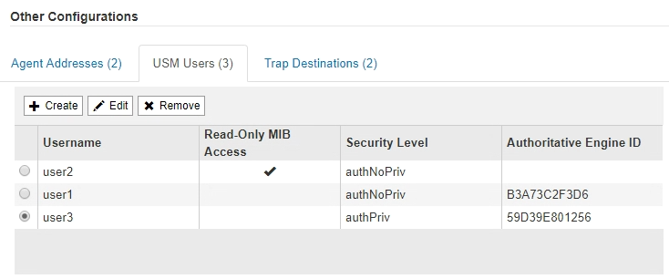

= Mettez à jour l'agent SNMP
:allow-uri-read: 
:icons: font
:imagesdir: ../media/

[role="lead"]
Vous pouvez désactiver les notifications SNMP, mettre à jour les chaînes de communauté ou ajouter ou supprimer des adresses d'agent, des utilisateurs USM et des destinations d'interruption.

.Avant de commencer
* Vous devez être connecté au Grid Manager à l'aide d'un link:../admin/web-browser-requirements.html["navigateur web pris en charge"].
* Vous devez disposer de l'autorisation d'accès racine.

.Description de la tâche
Chaque fois que vous mettez à jour le link:configuring-snmp-agent.html["Configuration de l'agent SNMP"], N'oubliez pas que vous devez sélectionner *Enregistrer* en bas de la page Agent SNMP pour valider les modifications que vous avez apportées à chaque onglet.

.Étapes
. Sélectionnez *CONFIGURATION* > *surveillance* > *agent SNMP*.
+
La page agent SNMP s'affiche.

. Si vous souhaitez désactiver l'agent SNMP sur tous les nœuds de la grille, décochez la case *Activer SNMP* et sélectionnez *Enregistrer*.
+
L'agent SNMP est désactivé pour tous les nœuds de la grille. Si vous réactivez ultérieurement l'agent, tous les paramètres de configuration SNMP précédents sont conservés.

. Vous pouvez également mettre à jour les valeurs saisies pour *Contact système* et *emplacement système*.
. Vous pouvez également décocher la case *Activer les notifications d'agent SNMP* si vous ne souhaitez plus que l'agent SNMP StorageGRID envoie des notifications d'interruption et d'information.
+
Lorsque cette case est décochée, l'agent SNMP prend en charge l'accès MIB en lecture seule, mais n'envoie pas de notifications SNMP.

. Vous pouvez également décocher la case *Activer les interruptions d'authentification* si vous ne souhaitez plus que l'agent SNMP StorageGRID envoie une interruption d'authentification lorsqu'il reçoit un message de protocole authentifié de manière incorrecte.
. Si vous utilisez SNMPv1 ou SNMPv2c, vous pouvez mettre à jour la section chaînes de communauté.
+
Les champs de cette section sont utilisés pour l'authentification communautaire dans SNMPv1 ou SNMPv2c. Ces champs ne s'appliquent pas au protocole SNMPv3.

+

NOTE: Si vous souhaitez supprimer la chaîne de communauté par défaut, vous devez d'abord vous assurer que toutes les destinations de déroutement utilisent une chaîne de communauté personnalisée.

. Pour mettre à jour les adresses des agents, sélectionnez l'onglet adresses des agents dans la section autres configurations.
+
image::../media/snmp_other_configurations_agent_addresses_table.png[SNMP autres configurations Tableau des adresses des agents]

+
Utilisez cet onglet pour spécifier une ou plusieurs « adresses d'écoute ». Ce sont les adresses StorageGRID sur lesquelles l'agent SNMP peut recevoir des requêtes. Chaque adresse de l'agent inclut un protocole Internet, un protocole de transport, un réseau StorageGRID et un port.

+
.. Pour ajouter une adresse d'agent, sélectionnez *Créer*. Ensuite, reportez-vous à l'étape pour connaître les adresses des agents dans les instructions de configuration de l'agent SNMP.
.. Pour modifier une adresse d'agent, sélectionnez le bouton radio correspondant à l'adresse et sélectionnez *Modifier*. Ensuite, reportez-vous à l'étape pour connaître les adresses des agents dans les instructions de configuration de l'agent SNMP.
.. Pour supprimer une adresse d'agent, sélectionnez le bouton radio correspondant à l'adresse et sélectionnez *Supprimer*. Ensuite, sélectionnez *OK* pour confirmer que vous souhaitez supprimer cette adresse.
.. Pour valider vos modifications, sélectionnez *Enregistrer* en bas de la page agent SNMP.

. Pour mettre à jour les utilisateurs USM, sélectionnez l'onglet utilisateurs USM dans la section autres configurations.
+

+
Utilisez cet onglet pour définir les utilisateurs USM autorisés à interroger la MIB ou à recevoir des interruptions et des informations.

+
.. Pour ajouter un utilisateur USM, sélectionnez *Create*. Reportez-vous ensuite à l'étape pour les utilisateurs d'USM dans les instructions de configuration de l'agent SNMP.
.. Pour modifier un utilisateur USM, sélectionnez le bouton radio de l'utilisateur et sélectionnez *Modifier*. Reportez-vous ensuite à l'étape pour les utilisateurs d'USM dans les instructions de configuration de l'agent SNMP.
+
Le nom d'utilisateur d'un utilisateur USM existant ne peut pas être modifié. Si vous devez modifier un nom d'utilisateur, vous devez le supprimer et en créer un nouveau.

+

NOTE: Si vous ajoutez ou supprimez l'ID moteur faisant autorité d'un utilisateur et que cet utilisateur est actuellement sélectionné pour une destination, vous devez modifier ou supprimer la destination, comme indiqué à l'étape <<SNMP_TRAP_DESTINATION,Destination du trap SNMP>>. Sinon, une erreur de validation se produit lorsque vous enregistrez la configuration de l'agent SNMP.

.. Pour supprimer un utilisateur USM, sélectionnez le bouton radio de l'utilisateur et sélectionnez *Supprimer*. Ensuite, sélectionnez *OK* pour confirmer que vous souhaitez supprimer cet utilisateur.
+

NOTE: Si l'utilisateur que vous avez supprimé est actuellement sélectionné pour une destination de recouvrement, vous devez modifier ou supprimer la destination, comme indiqué à l'étape <<SNMP_TRAP_DESTINATION,Destination du trap SNMP>>. Sinon, une erreur de validation se produit lorsque vous enregistrez la configuration de l'agent SNMP.

.. Pour valider vos modifications, sélectionnez *Enregistrer* en bas de la page agent SNMP.

. [[SNMP_TRAP_DESTINATION, start=9]]si vous souhaitez mettre à jour les destinations d'interruption, sélectionnez l'onglet Trap destinations (destinations d'interruption) dans la section Other configurations.
+
L'onglet destinations de recouvrement permet de définir une ou plusieurs destinations pour les notifications d'interruption StorageGRID ou d'information. Lorsque vous activez l'agent SNMP et sélectionnez *Enregistrer*, StorageGRID commence à envoyer des notifications à chaque destination définie. Des notifications sont envoyées lorsque des alertes et des alarmes sont déclenchées. Les notifications standard sont également envoyées pour les entités MIB-II prises en charge (par exemple, ifdown et coldStart).

+
.. Pour ajouter une destination d'interruption, sélectionnez *Créer*. Reportez-vous ensuite à l'étape pour connaître les destinations de déroutement dans les instructions de configuration de l'agent SNMP.
.. Pour modifier une destination d'interruption, sélectionnez le bouton radio de l'utilisateur et sélectionnez *Modifier*. Reportez-vous ensuite à l'étape pour connaître les destinations de déroutement dans les instructions de configuration de l'agent SNMP.
.. Pour supprimer une destination d'interruption, sélectionnez le bouton radio de la destination et sélectionnez *Supprimer*. Ensuite, sélectionnez *OK* pour confirmer que vous souhaitez supprimer cette destination.
.. Pour valider vos modifications, sélectionnez *Enregistrer* en bas de la page agent SNMP.

. Lorsque vous avez mis à jour la configuration de l'agent SNMP, sélectionnez *Enregistrer*.

