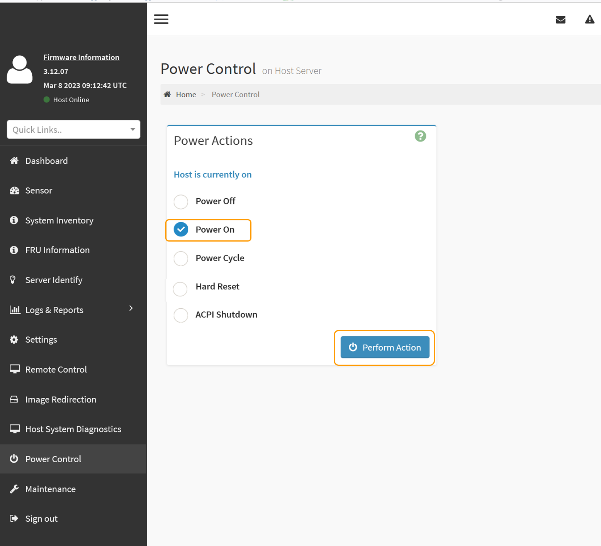

= Mettez le SGF6112 sous tension et vérifiez son fonctionnement
:allow-uri-read: 
:icons: font
:imagesdir: ../media/

[role="lead"]
Mettez le contrôleur sous tension après la fin de la maintenance.

.Avant de commencer
* Vous avez installé le contrôleur dans une armoire ou un rack et connecté les câbles de données et d'alimentation.
+
link:reinstalling-sgf6112-into-cabinet-or-rack.html["Réinstallez le contrôleur SGF6112 dans l'armoire ou le rack"]

* Vous avez physiquement situé le contrôleur dans le data Center.
+
link:locating-sgf6112-in-data-center.html["Localisez l'appliance SGF6112 dans le data Center"]

.Étapes
. Mettez l'appareil sous tension.
+
Vous devrez peut-être retirer le cadre pour accéder à l'interrupteur d'alimentation. Si c'est le cas, n'oubliez pas de le réinstaller ensuite.

. Surveillez les voyants du contrôleur et les codes de démarrage à l'aide de l'une des méthodes suivantes :
+
** Appuyer sur le bouton de mise sous tension situé à l'avant du contrôleur.
** Utilisez l'interface du contrôleur BMC :
+
... Accéder à l'interface du contrôleur BMC.
+
link:../installconfig/accessing-bmc-interface.html["Accéder à l'interface BMC"]

... Sélectionnez *Power Control*.
... Sélectionnez *Marche*, puis *Exécuter l'action*.
+

+
Utilisez l'interface BMC pour surveiller l'état de démarrage.

. Vérifiez que le contrôleur de l'appliance s'affiche dans Grid Manager et sans alertes.
+
L'affichage du contrôleur dans Grid Manager peut prendre jusqu'à 20 minutes.

+

CAUTION: Ne mettez pas un autre nœud d'appliance hors ligne sauf si cette appliance présente une icône verte.

. Vérifiez que la nouvelle appliance est entièrement opérationnelle en vous connectant au nœud grid à l'aide de PuTTY ou d'un autre client ssh :
+
.. Saisissez la commande suivante : `ssh _Appliance_IP_`
.. Entrez le mot de passe indiqué dans le `Passwords.txt` fichier.
.. Entrez la commande suivante pour passer à la racine : `su -`
.. Entrez le mot de passe indiqué dans le `Passwords.txt` fichier.
+
Lorsque vous êtes connecté en tant que root, l'invite passe de `$` à `#`.

.Informations associées
link:../installconfig/viewing-status-indicators.html["Afficher les indicateurs d'état"]
