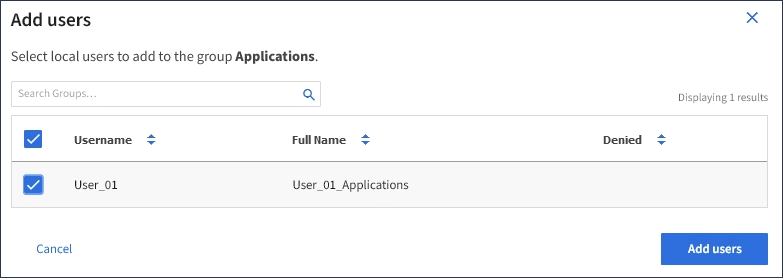

= Ajouter des utilisateurs à un groupe local
:allow-uri-read: 
:icons: font
:imagesdir: ../media/

[role="lead"]
Vous pouvez ajouter des utilisateurs à un groupe local si nécessaire.

.Avant de commencer
* Vous êtes connecté au Gestionnaire de locataires à l'aide d'un link:../admin/web-browser-requirements.html["navigateur web pris en charge"].
* Vous appartenez à un groupe d'utilisateurs disposant de l'autorisation d'accès racine.

.Étapes
. Sélectionnez *ACCESS MANAGEMENT* > *Groups*.
. Sélectionnez le nom du groupe local auquel vous souhaitez ajouter des utilisateurs.
+
Vous pouvez également sélectionner *actions* > *Afficher les détails du groupe*.

+
La page des détails du groupe s'affiche.

+
image::../media/tenant_group_details.png[Afficher les détails du groupe]

. Sélectionnez *utilisateurs*, puis *Ajouter utilisateurs*.
+
image::../media/manage_users.png[Gérer les utilisateurs]

. Sélectionnez les utilisateurs que vous souhaitez ajouter au groupe, puis sélectionnez *Ajouter utilisateurs*.
+

+
Un message de confirmation s'affiche dans le coin supérieur droit de la page.

