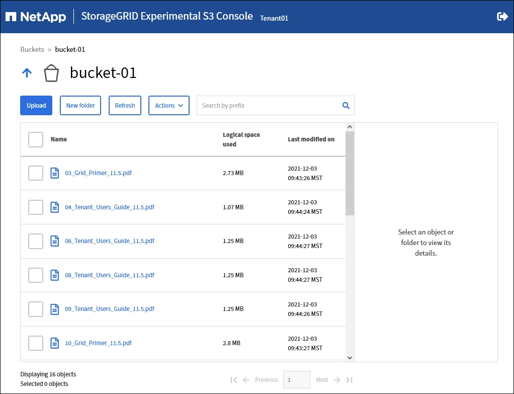

= Utilisation de la console Experimental S3
:allow-uri-read: 
:icons: font
:imagesdir: ../media/

[role="lead"]
Vous pouvez utiliser la console S3 pour afficher les objets d'un compartiment S3.

Vous pouvez également utiliser la console S3 pour :

* Ajouter et supprimer des objets, des versions d'objet et des dossiers
* Renommez les objets
* Déplacer et copier des objets entre des compartiments et des dossiers
* Gérer les balises d'objet
* Afficher les métadonnées d'objet
* Télécharger des objets

NOTE: La console S3 est marquée comme « expérimentale » car elle n'est pas encore complète ou approuvée pour une utilisation dans un environnement de production. Les locataires ne doivent utiliser la console S3 que lors de l'exécution de fonctions sur un petit nombre d'objets, par exemple lors du chargement d'objets pour simuler une nouvelle règle ILM, pour résoudre les problèmes d'ingestion ou via des grilles de validation technique ou non-production.

.Avant de commencer
* Vous êtes connecté au Gestionnaire de locataires à l'aide d'un link:../admin/web-browser-requirements.html["navigateur web pris en charge"].
* Vous appartenez à un groupe d'utilisateurs disposant de l'autorisation d'accès racine ou disposant à la fois des options gérer tous les compartiments et gérer les objets avec la console S3 link:tenant-management-permissions.html["autorisations"].
+

NOTE: Les utilisateurs disposant de l'autorisation gérer les objets avec la console S3, mais qui ne disposent pas de l'autorisation gérer tous les compartiments, peuvent toujours naviguer directement vers la console S3 expérimentale.

* Vous avez créé un compartiment.
* Une règle de groupe S3 ou de compartiment a été configurée pour l'utilisateur.
* Vous connaissez l'ID de clé d'accès de l'utilisateur et la clé d'accès secrète. Si vous le souhaitez, vous avez un `.csv` fichier contenant ces informations. Voir la link:creating-your-own-s3-access-keys.html["instructions pour la création de clés d'accès"].

.Étapes
. Sélectionnez *godets*.
. Sélectionnez image:../media/s3_console_link.png["Lien vers la console S3"]. Vous pouvez également accéder à ce lien à partir de la page des détails du compartiment.
. Sur la page de connexion de la console Experimental S3, collez l'ID de clé d'accès et la clé secrète dans les champs. Sinon, sélectionnez *Télécharger les touches d'accès* et sélectionnez votre `.csv` fichier.
. Sélectionnez *connexion*.
. Gérez les objets selon vos besoins.

